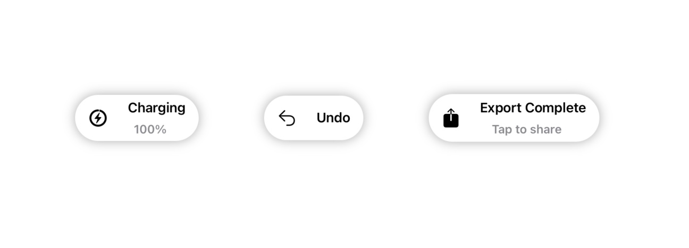

# ToastUI


A package for displaying sleek iOS-style toast notifications with SwiftUI. It's intended to mimic the toasts seen when charging an Apple Pencil or connecting AirPods.

## Examples


## Setup

### Swift Package Manager
ToastUI is a Swift package that can be installed through the 'Package Dependencies' list in your Xcode project. Or, you can add the following line to your own Package.swift file:
```swift
dependencies: [
    .package(url: "https://github.com/jebenjamin/ToastUI", from: "1.0.0")
]
```

### Manually
Drag and drop the `ToastUI` folder into your project.

## Usage
ToastUI is built for SwiftUI. Use a `ZStack` to layer a `ToastView` on top of the view you want to display a toast for. Like so:
```swift
ZStack {
    ToasterView(title: "Title",
                subtitle: "Subtitle",
                position: .top,
                duration: 5)
    
    Text("Placeholder")
    // and some other views...
}
```
Once the toast fades out, the view is removed from the hierarchy.

## Options
- `symbol`: A string that refers to an SF symbol displayed on the left of the text in the toast. Optional.
- `title`: A title string that will be displayed at the top of the toast. Required.
- `subtitle`: A subtitle string that will be displayed at the bottom of the toast. Optional.
- `position`: `.top` places the toast at the top of the stack, `.bottom` places it at the bottom. Required.
- `duration`: A double referring to the number of seconds the toast is displayed. Optional. If empty, the toast will remain fixed in position for the lifecycle of the view. Otherwise, it will fade out once the duration has elapsed.

## Compatibility
Requires iOS 13.0+ or Mac Catalyst 13.0+. 

## License
ToastUI uses the MIT license. A copy is available in `LICENSE.md`.
